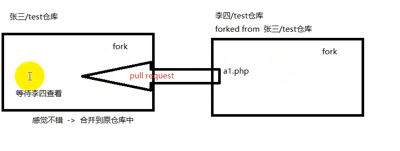

# 一级标题
## 二级标题
### 三级标题
###### 最多支持六级标题
删除线 ~~文字~~
*斜体*
**加粗**
***斜体+加粗***
<u>下划线 同html</u>
== 高亮 （需要勾选扩展语法，不知道vscode怎么用）==
**下标：** H~2~O
**上标：** m^2^

### 表格
使用|分割单元格，使用-分割表头和其他行
name | price
------------- | ------------
chicken | 19
cola | 15

默认表格是左对齐，若要改变可加：，加哪边就是哪边对齐，居中加两边
name | price
------------- | :------------:
chicken | 19
cola | 15

### 引用
>不知妻美
>>嵌套引用

###列表
#### 无序列表
* 第一点
* 回车会默认填充
也可以使用+/-标记

####有序列表
1. 以数字.空格开头
2. 使用数字\.来消除转义
3\.

### 代码块
#### 代码块
```java
public static void main(String[] args){

}
```
结束
#### 行内代码
`markdown`
`java`


### 分隔线
***
---

### 跳转
#### 外部跳转
[提示文字](www.baidu.com)

#### 内部跳转
[提示文字](content.md)

### 自动链接
<lanxinli98@qq.com>

### 图片
![自己想写的文字][图片地址]

黏贴图片快捷键：Shift+Alt+V 插件Markdown Image，但官方的快捷键不一定靠谱：
[参考网站](https://blog.csdn.net/AAAA_pril/article/details/124911276)
  

修改字体和背景颜色同HTML，详细可搜索
<font style=background:red>Test</font>
<font color=Blue>Test</font>
用RGB也可以