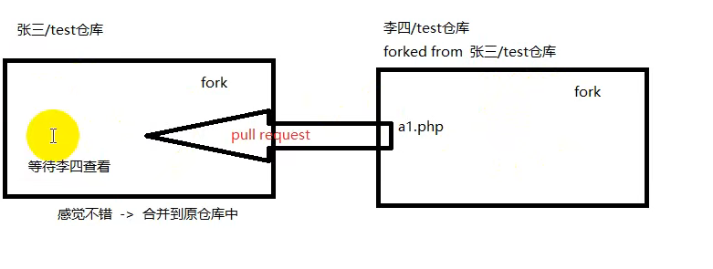

  
### github基础
仓库 repository
收藏 star
复制克隆 fork
发起请求 pull request
李四的仓库是独立存在的
关注 watch 有任何的更新都可以收到
发布事件 issue 如有BUG，但暂时没有解决方案，需要讨论，解决后可关闭issue

### 创建新项目
一个git管理一个库，对应一个开源项目
  
commit的意思是这个项目累计提交了多少词，包括在网页上的修改后保存也算提交一次
  
  
 1](images/76e3b07125f37696cf7d7e98c1dd05d519148bcb644ad7e5370b566be8bf95b1.png)  
  
  
 1](images/76e3b07125f37696cf7d7e98c1dd05d519148bcb644ad7e5370b566be8bf95b1.png)  
 1](images/0a3c54f5188282f3d5a8d4924dfb54f13d5364db6ff96042d34cc63cd2d023cc.png)  
  

如果需要详细的修改记录，都可以点击commit查看

### Git工作区域
  
  
 1](images/cefdcbb06afe7ed6bcedf8432ca25d1422e116cb87a07f27765e22cfd4a33ab6.png)  

### 版本控制
#### 文件
缺点：文件夹多且杂乱
#### 本地
只能看到1个文件，其下显示各个版本的信息
#### 集中式
缺点：一旦中心断网，即无法操作
  

#### 分布式
  
即不仅在服务器中存有所有版本，在每台电脑上也存在相应版本
并且，可以先把版本储存在本地，改完一并提交，而集中式是没有本地的这步缓冲的，要只能一步提交到中心。分布式中心挂掉以后不影响版本的迭代。

### Git 实战
文件夹右键，Git Bash here
  
